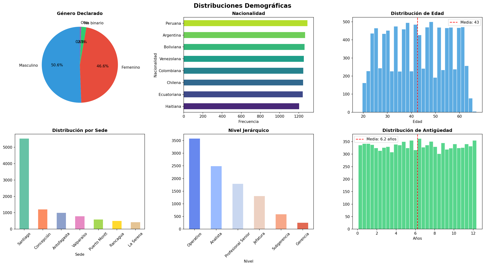
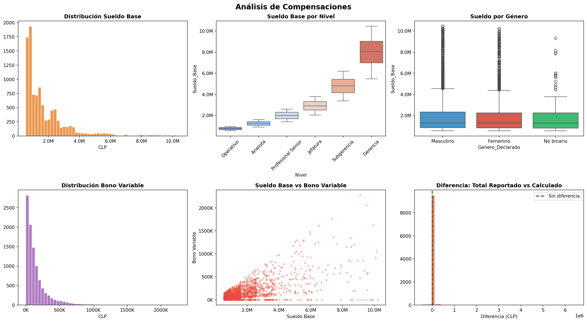
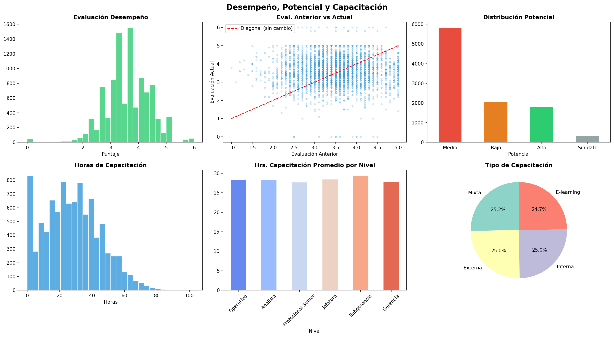
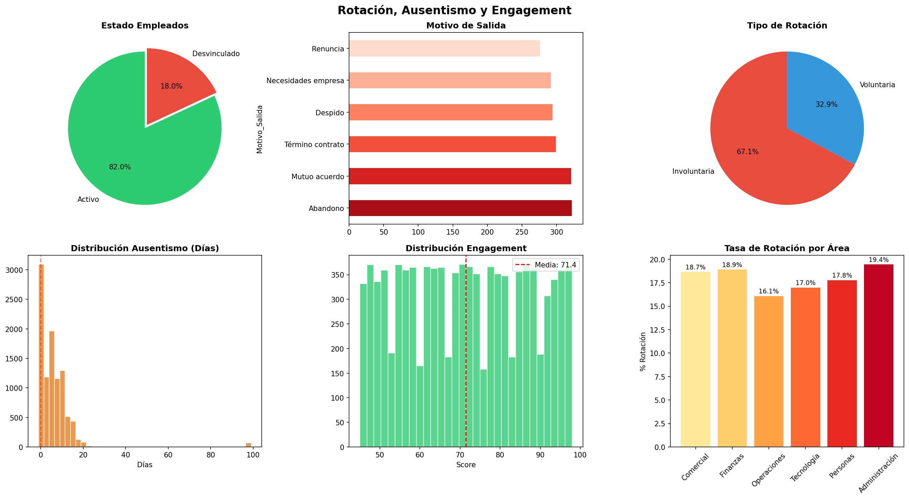
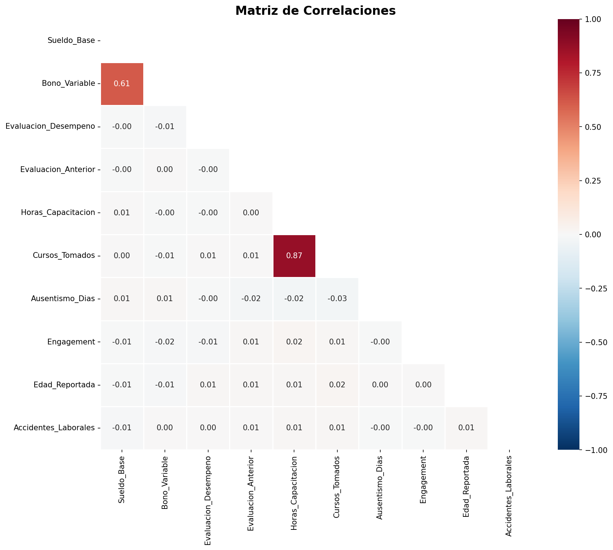
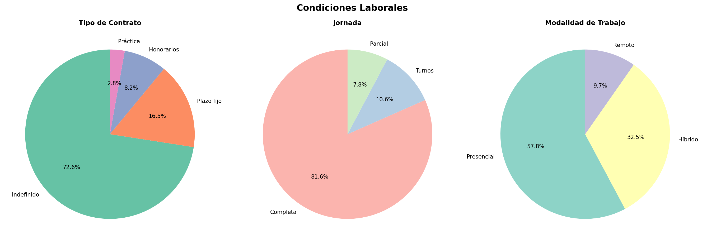
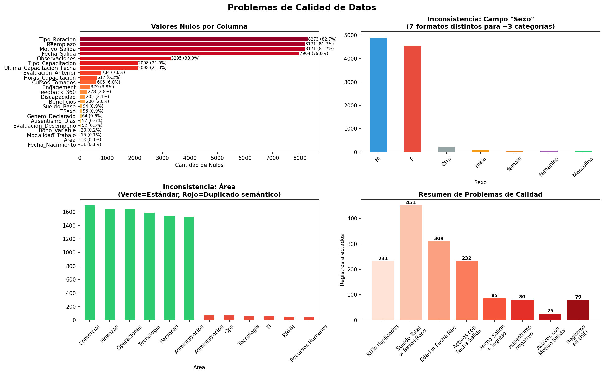

# EDA — Base de Datos CERTAMEN 2
## InnovaTalento SpA · 10.000 registros · 44 columnas

---

## 1. Resumen General del Dataset

| Dimensión | Valor |
|-----------|-------|
| **Registros** | 10.000 empleados |
| **Columnas** | 44 variables |
| **Empresa** | InnovaTalento SpA (única) |
| **Hojas** | `Datos` + `Diccionario` |
| **ID único** | `ID_Empleado` (sin duplicados) |
| **Estado** | 82.0% Activos / 18.0% Desvinculados |

### Tipología de variables
- **Categóricas**: 28 columnas (Sexo, Área, Cargo, Nivel, Sede, etc.)
- **Numéricas**: 8 columnas (sueldos, evaluaciones, capacitación, engagement)
- **Fechas**: 5 columnas (nacimiento, ingreso, salida, última capacitación)
- **Identificadores**: 3 columnas (ID, RUT, Nombre+Apellido)

---

## 2. Distribuciones Demográficas

### Hallazgos clave

| Variable | Hallazgo |
|----------|----------|
| **Género** | 50.3% Masculino, 46.3% Femenino, 2.1% No binario, 0.6% Otro |
| **Nacionalidad** | 8 nacionalidades, distribución casi uniforme (~12.0-12.9% c/u). Peruana lidera con 12.9% |
| **Edad** | Rango 18-67, media 42.5 años, distribución uniforme |
| **Sede** | Santiago concentra 55.2%. Concepción (12.0%), Antofagasta (9.9%), Valparaíso (7.8%) |
| **Nivel** | Estructura piramidal sana: 35.8% Operativo → 2.5% Gerencia |
| **Antigüedad** | Media 6.2 años, rango 0.1-12.3 años, distribución uniforme |

---

## 3. Análisis de Compensaciones

### Hallazgos clave

| Métrica | Valor |
|---------|-------|
| **Sueldo Base medio** | $1.802.873 CLP |
| **Sueldo Base mediana** | $1.291.893 CLP |
| **Bono Variable medio** | $154.611 CLP |
| **Correlación Sueldo-Bono** | 0.614 (moderada-alta) |

### Sueldo por Nivel Jerárquico

| Nivel | Sueldo Medio | Sueldo Mediana |
|-------|-------------|---------------|
| Operativo | $751.365 | $752.639 |
| Analista | $1.246.543 | $1.244.894 |
| Profesional Senior | $2.001.591 | $2.005.555 |
| Jefatura | $2.919.283 | $2.914.767 |
| Subgerencia | $4.793.356 | $4.802.727 |
| Gerencia | $8.034.196 | $8.059.100 |

> [!NOTE]
> La progresión salarial por nivel es coherente y consistente (media ≈ mediana en cada nivel), lo que sugiere distribuciones simétricas dentro de cada banda.

### Brecha Salarial por Género

| Género | Sueldo Medio | Sueldo Mediana |
|--------|-------------|---------------|
| Masculino | $1.839.175 | $1.284.462 |
| Femenino | $1.763.944 | $1.297.636 |
| No binario | $1.768.796 | $1.273.309 |

> [!TIP]
> La brecha salarial por género en **media** es de ~4.1% a favor de hombres, pero la **mediana** es prácticamente idéntica. Esto sugiere que la diferencia está impulsada por outliers en puestos altos, no por una brecha sistémica generalizada.

---

## 4. Desempeño, Potencial y Capacitación

### Hallazgos clave

| Variable | Hallazgo |
|----------|----------|
| **Evaluación Desempeño** | Rango 0.0-6.0, media 3.6 |
| **Evaluación Anterior** | Rango 1.0-5.0, media 3.5 |
| **Potencial** | 58.2% Medio, 20.6% Bajo, 18.0% Alto, 3.1% Sin dato |
| **Horas Capacitación** | Media 28.3 hrs, 6.4% sin capacitación (0 hrs) |
| **Cursos Tomados** | Media 3.6 cursos |
| **Tipo Capacitación** | Distribución uniforme: Mixta/Externa/Interna/E-learning (~25% c/u) |

> [!WARNING]
> La **Evaluación Desempeño tiene rango 0.0-6.0** pero la **Evaluación Anterior tiene rango 1.0-5.0**. Esto indica que las escalas son **inconsistentes** entre periodos o que hay datos erróneos (evaluaciones en 0 o 6).

---

## 5. Rotación, Ausentismo y Engagement

### Rotación

| Métrica | Valor |
|---------|-------|
| **Tasa rotación global** | 18.0% |
| **Rotación involuntaria** | 63.4% de las salidas |
| **Rotación voluntaria** | 31.0% de las salidas |
| **Sin dato tipo rotación** | 5.6% |

### Motivos de Salida (desvinculados)

| Motivo | Cantidad |
|--------|----------|
| Abandono | 328 |
| Mutuo acuerdo | 327 |
| Término contrato | 303 |
| Despido | 298 |
| Necesidades empresa | 295 |
| Renuncia | 278 |

### Rotación por Área

| Área | Tasa |
|------|------|
| Administración | 19.4% |
| Finanzas | 18.9% |
| Comercial | 18.7% |
| Personas | 17.8% |
| Tecnología | 17.0% |
| Operaciones | 16.1% |

### Engagement y Ausentismo

| Métrica | Valor |
|---------|-------|
| **Engagement medio** | 71.4 / 100 |
| **Engagement rango** | 45-98 |
| **Ausentismo medio** | 5.9 días |
| **Ausentismo mediana** | 5.0 días |
| **Accidentes laborales** | Media 0.09, máximo 3 |

> [!NOTE]
> El engagement es **homogéneo** entre áreas (71.3-71.6), lo cual puede indicar un dato sintético o una encuesta con baja variabilidad real.

---

## 6. Matriz de Correlaciones

### Correlaciones destacadas

| Par de Variables | r | Interpretación |
|-----------------|---|---------------|
| **Horas Capacitación ↔ Cursos Tomados** | 0.875 | Muy alta. Esperado: más cursos = más horas |
| **Sueldo Base ↔ Bono Variable** | 0.614 | Moderada-alta. Bono proporcional al sueldo |
| **Todas las demás** | < 0.025 | Esencialmente sin correlación |

> [!IMPORTANT]
> La ausencia casi total de correlaciones entre desempeño, capacitación, engagement y compensación es **inusual** en datos reales. Variables como evaluación-sueldo o capacitación-desempeño suelen tener al menos correlaciones débiles. Esto refuerza que el dataset es **sintético/simulado** con variables generadas independientemente.

---

## 7. Condiciones Laborales

| Variable | Distribución |
|----------|-------------|
| **Tipo Contrato** | 72.6% Indefinido, 16.5% Plazo Fijo, 8.2% Honorarios, 2.8% Práctica |
| **Jornada** | 81.6% Completa, 10.6% Turnos, 7.8% Parcial |
| **Modalidad** | 57.7% Presencial, 32.5% Híbrido, 9.7% Remoto |

---

## 8. Problemas de Calidad de Datos

### 8.1 Valores Nulos

| Columna | Nulos | % | Justificación |
|---------|-------|---|---------------|
| Tipo_Rotacion | 8.273 | 82.7% | Esperado: solo aplica a desvinculados |
| Motivo_Salida | 8.171 | 81.7% | Esperado: solo aplica a desvinculados |
| Reemplazo | 8.171 | 81.7% | Esperado: solo aplica a desvinculados |
| Fecha_Salida | 7.964 | 79.6% | Esperado: solo aplica a desvinculados |
| Observaciones | 3.295 | 33.0% | Parcialmente esperado |
| Tipo_Capacitacion | 2.098 | 21.0% | ⚠️ Problemático |
| Evaluacion_Anterior | 784 | 7.8% | Razonable: empleados nuevos |
| Horas_Capacitacion | 617 | 6.2% | ⚠️ Dato faltante |
| Engagement | 379 | 3.8% | ⚠️ Encuesta no completada |
| Sueldo_Base | 94 | 0.9% | ⚠️ Crítico: dato esencial |

### 8.2 Inconsistencias de Formato

> [!CAUTION]
> **Campo `Sexo`**: 7 formatos distintos para ~3 categorías reales.
> - Formatos encontrados: `M`, `F`, `Otro`, `male`, `female`, `Femenino`, `Masculino`
> - **Acción**: Estandarizar a `M`, `F`, `Otro`

> [!CAUTION]
> **Campo `Area`**: 12 valores para 6 áreas reales.
> - Duplicados semánticos: `Administración`/`Administracion`, `Operaciones`/`Ops`, `Tecnología`/`Tecnologia`/`TI`, `Personas`/`RRHH`/`Recursos Humanos`
> - **Acción**: Normalizar a 6 categorías estándar

### 8.3 Inconsistencias Lógicas

| Problema | Registros | % | Gravedad |
|----------|-----------|---|----------|
| **Sueldo Total ≠ Base + Bono** | 451 | 4.5% | 🔴 Alta |
| **Edad ≠ Fecha Nacimiento** (>1 año) | 309 | 3.1% | 🟡 Media |
| **Activos con Fecha de Salida** | 232 | 2.3% | 🔴 Alta |
| **RUTs duplicados** | 231 | 2.3% | 🔴 Alta |
| **Fecha Salida < Fecha Ingreso** | 85 | 0.9% | 🔴 Alta |
| **Ausentismo negativo** (-1 día) | 80 | 0.8% | 🟡 Media |
| **Registros en USD** (sin conversión) | 79 | 0.8% | 🟡 Media |
| **Activos con Motivo de Salida** | 25 | 0.3% | 🔴 Alta |
| **Eval. Desempeño en 0.0 o 6.0** | — | — | 🟡 Escala inconsistente |

### 8.4 Outliers Numéricos (método IQR)

| Variable | Outliers | % | Rango Normal | Valores Extremos |
|----------|----------|---|-------------|-----------------|
| Bono Variable | 789 | 7.9% | [0, 419K] | max 2.276M |
| Sueldo Base | 604 | 6.1% | [0, 4.5M] | max 10.5M |
| Cursos Tomados | 97 | 1.0% | [0, 10] | max 12 |
| Ausentismo | 83 | 0.8% | [0, 22] | max 99 |
| Horas Capacitación | 36 | 0.4% | [0, 76] | max 103 |
| Engagement | 0 | 0.0% | [18, 126] | sin outliers |

---

## 9. Conclusiones y Recomendaciones

### Prioridades de Limpieza (antes de modelar o crear dashboards)

1. **🔴 Estandarizar `Sexo`** → Mapear los 7 formatos a 3 categorías (`M`, `F`, `Otro`)
2. **🔴 Normalizar `Area`** → Consolidar 12 valores en 6 áreas canónicas
3. **🔴 Corregir Sueldo Total** → 451 registros donde `Sueldo_Total ≠ Sueldo_Base + Bono`
4. **🔴 Resolver Activos con Fecha Salida** → 232 registros con estado contradictorio
5. **🔴 Tratar RUTs duplicados** → 231 RUTs repetidos con IDs distintos
6. **🔴 Corregir fechas invertidas** → 85 registros con salida anterior al ingreso
7. **🟡 Tratar registros en USD** → Convertir 79 registros a CLP o marcar claramente
8. **🟡 Corregir ausentismo negativo** → 80 registros con -1 día
9. **🟡 Imputar nulos** en variables operativas: Sueldo_Base (94), Engagement (379), Horas_Capacitación (617)
10. **🟡 Homologar escala de evaluación** → Actual rango [0, 6] vs Anterior [1, 5]

### Insights Analíticos Relevantes

- La **estructura salarial por nivel es coherente** y bien estratificada
- La **brecha de género** existe en media (~4%) pero no en mediana → concentrada en cargos altos
- La **rotación es homogénea** entre áreas (16-19%), sin focos claros de alarma
- El **engagement es plano** (~71 en todas las áreas), sugiriendo baja discriminación del instrumento
- **Casi no hay correlación** entre variables que normalmente la tendrían (capacitación↔desempeño, engagement↔ausentismo), consistente con datos **simulados**
